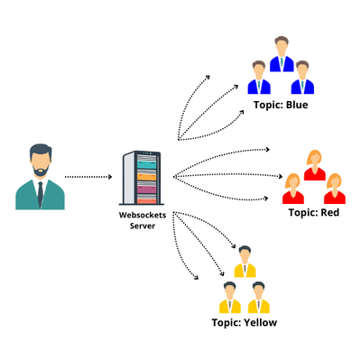

# Distribución de Archivos Simple con Servidor y Clientes basados en WebSocket

 [Versión en inglés](README.md)

Este proyecto proporciona un servidor WebSocket para distribuir archivos entre clientes. Permite a los clientes conectarse, suscribirse a temas específicos y recibir archivos enviados por otros clientes. Codifica los datos del archivo en base64 antes de enviarlos. 

## Posibles Casos de Uso

1. **Aula**:
   - **Colaboración en Tiempo Real**: Los estudiantes pueden compartir archivos y trabajar juntos en proyectos o tareas.
   - **Distribución de Material**: Los profesores pueden enviar materiales de lectura, presentaciones o ejercicios directamente a los estudiantes.
2. **Oficina**:
   - **Compartir Documentos**: Los empleados pueden enviar archivos importantes o actualizaciones a sus colegas.
   - **Notificaciones en Tiempo Real**: Se pueden enviar alertas o actualizaciones a los miembros del equipo.
3. **Hogar**:
   - **Compartir Fotos o Videos**: Los miembros de la familia pueden intercambiar fotos o videos.

## Ventajas Clave

**Página Web Autónoma**: La página web para enviar o recibir archivos se puede alojar directamente en el dispositivo del usuario. No es necesario un servidor web externo, lo que resulta conveniente para uso local o personal.

**Agrupación Basada en Temas (topics)**: El uso de temas (topics) simplifica la distribución de archivos. Los clientes pueden suscribirse a canales específicos (temas) según sus intereses o roles, asegurando que reciban archivos relevantes.



Cuando se envía un archivo a un tema (topic) específico, todos los que estén escuchando ese tema lo recibirán.

## Instalación 

Primero, clona el repositorio:

```she
git clone https://github.com/soyunomas/websockets-send.gitgit clone https://github.com/soyunomas/websockets-send.git
```

Navega al directorio del proyecto:

```shell
cd websockets-send
```

Instala las dependencias:

```sh
pip install websockets
```

## Uso

### Iniciar el servidor

Para iniciar el servidor WebSocket, ejecuta el siguiente comando:

```sh
python3 server.py -p 8765 -i 0.0.0.0
```

Reemplaza `8765` con el número de puerto deseado y `0.0.0.0` con la dirección IP deseada.


### Abrir index.html o receive.py

Ahora abre el archivo `index.html` en tu navegador web para conectarte al servidor WebSocket.


Alternativamente, puedes usar `receive.py` para descargar archivos desde la línea de comandos. El archivo se guardará en el directorio desde el cual ejecutes `receive.py`.

Por ejemplo:

```sh
python receive.py -u ws://localhost:8765 -t chat
```

Esto se conectará al servidor WebSocket en `ws://localhost:8765` y se suscribirá al tema `chat` para recibir archivos.


### Enviar archivo al navegador con sender.html

Abre el archivo `sender.html` en tu navegador web para conectarte al servidor WebSocket y enviar un archivo.


### Alternativa, enviar archivo al navegador con sender.py

Usa el script `sender.py` para enviar archivos al servidor. El formato del comando es el siguiente:

```sh
python3 sender.py -u ws://localhost:8765 -t chat -f /path/to/file.txt
```

- `-u ws://localhost:8765`: Esto especifica la URL del servidor WebSocket. Reemplaza `ws://localhost:8765` con la URL apropiada de tu servidor WebSocket si es diferente.
- `-t chat`: Esto especifica el tema al cual se enviará el archivo. Reemplaza `chat` con el tema deseado.
- `-f /path/to/file.txt`: Esto especifica la ruta del archivo que deseas enviar. Reemplaza `/path/to/file.txt` con la ruta real del archivo que deseas distribuir.


## Descripción de archivos

### server.py

- **Descripción:** Este archivo implementa un servidor WebSocket para manejar la distribución de archivos entre clientes. Escucha conexiones WebSocket entrantes, maneja suscripciones a temas y reenvía archivos recibidos a los clientes suscritos.

- **Uso:** El servidor se puede iniciar usando las opciones de línea de comandos (CLI) proporcionadas para especificar el puerto y la dirección IP en la que escuchará.

- **Funcionalidad:**
  
  - Escucha conexiones WebSocket.
  - Maneja mensajes entrantes de los clientes.
  - Soporta suscripciones a temas.
  - Distribuye archivos a clientes suscritos a temas específicos.

### sender.py

- **Descripción:** Este archivo proporciona una interfaz de línea de comandos (CLI) para enviar archivos al servidor WebSocket. Se conecta al servidor a través de WebSocket, lee archivos del sistema de archivos local, los codifica en base64 y los envía al servidor con el tema especificado.

- **Uso:** Los usuarios pueden especificar la URI del WebSocket, el tema y la ruta del archivo como argumentos de línea de comandos para enviar archivos al servidor.

- **Funcionalidad:**
  
  - Establece una conexión WebSocket con el servidor.
  - Lee archivos del sistema de archivos local.
  - Codifica archivos en base64.
  - Envía archivos al servidor con el tema especificado.

### receive.py

- **Descripción:** Este archivo proporciona una interfaz de línea de comandos (CLI) para recibir archivos del servidor WebSocket. Se conecta al servidor a través de WebSocket, escucha mensajes entrantes y guarda los archivos recibidos en el sistema de archivos local.

- **Uso:** Los usuarios pueden especificar la URI del WebSocket y el tema como argumentos de línea de comandos para recibir archivos del servidor.

- **Funcionalidad:**
  
  - Establece una conexión WebSocket con el servidor.
  - Escucha mensajes entrantes del servidor.
  - Guarda archivos recibidos en el sistema de archivos local.

### index.html

- **Descripción:** Este archivo HTML contiene una interfaz web simple para interactuar con el servidor WebSocket. Permite a los usuarios conectarse al servidor, suscribirse a temas y descargar archivos recibidos del servidor.

- **Uso:** Los usuarios pueden abrir el archivo HTML en un navegador web para acceder a la interfaz web.

- **Funcionalidad:**
  
  - Se conecta al servidor WebSocket usando JavaScript.
  - Permite a los usuarios suscribirse a temas y descargar archivos recibidos del servidor.
  - Proporciona una interfaz amigable para interactuar con el servidor.

### sender.html

- **Descripción:** Este archivo HTML proporciona una interfaz web simple para enviar archivos a un servidor WebSocket. Permite a los usuarios conectarse al servidor, especificar el tema del mensaje, seleccionar un archivo de su sistema local y enviarlo al servidor.

- **Uso:** Los usuarios pueden abrir el archivo HTML en un navegador web y completar la URL del WebSocket, el tema y seleccionar un archivo para enviar. Después de conectarse al servidor, pueden hacer clic en el botón "Send File" para subir el archivo seleccionado al servidor.

- **Funcionalidad:**
  
  - Se conecta al servidor WebSocket usando JavaScript.
  - Permite a los usuarios especificar la URL del WebSocket y el tema del mensaje.
  - Proporciona un campo de entrada de archivo para seleccionar archivos a enviar.
  - Después de conectarse al servidor y seleccionar un archivo, los usuarios pueden enviar el archivo al servidor haciendo clic en el botón "Send File".
  - Muestra un mensaje de confirmación después de que el archivo se envía con éxito.

## Cómo Funciona

- Los clientes pueden conectarse al servidor utilizando una URI de WebSocket.
- Al conectarse, los clientes pueden suscribirse a temas específicos para recibir archivos relacionados con esos temas.
- Cuando un cliente envía un archivo a un tema, el servidor distribuye el archivo a todos los clientes suscritos a ese tema.
- Los mensajes de archivo se formatean de la siguiente manera: `{mime_type}:{file_name}:{file_data}`.

# Limitación de Tamaño de Archivo del Proyecto

En este proyecto, el tamaño máximo de archivo para subidas y descargas está establecido en 500 MB. Este límite se aplica en los siguientes archivos: `server.py`, `sender.py` y `receive.py`.

Para cambiar el límite de tamaño máximo de archivo, debes modificar las secciones relevantes del código en estos archivos.

## Instrucciones para Cambiar el Tamaño Máximo de Archivo

1. **Abre `config.py`**:
   
   - Localiza la sección del código que establece el tamaño máximo de archivo.
   
   - Encontrarás las siguientes líneas:
     
     ```python
     # Establecer el tamaño máximo a 500 MB
     max_size = 500 * 1024 * 1024  # 500 MB
     ```
   
   - Modifica el valor de `max_size` según sea necesario.

## Dependencias

- Python 3.x
- websockets

#### MIT License

Copyright (c) 2024

Permission is hereby granted, free of charge, to any person obtaining a copy
of this software and associated documentation files (the "Software"), to deal
in the Software without restriction, including without limitation the rights
to use, copy, modify, merge, publish, distribute, sublicense, and/or sell
copies of the Software, and to permit persons to whom the Software is
furnished to do so, subject to the following conditions:

The above copyright notice and this permission notice shall be included in all
copies or substantial portions of the Software.

THE SOFTWARE IS PROVIDED "AS IS", WITHOUT WARRANTY OF ANY KIND, EXPRESS OR
IMPLIED, INCLUDING BUT NOT LIMITED TO THE WARRANTIES OF MERCHANTABILITY,
FITNESS FOR A PARTICULAR PURPOSE AND NONINFRINGEMENT. IN NO EVENT SHALL THE AUTHORS OR COPYRIGHT HOLDERS BE LIABLE FOR ANY CLAIM, DAMAGES OR OTHER LIABILITY, WHETHER IN AN ACTION OF CONTRACT, TORT OR OTHERWISE, ARISING FROM, OUT OF OR IN CONNECTION WITH THE SOFTWARE OR THE USE OR OTHER DEALINGS IN THE SOFTWARE.
