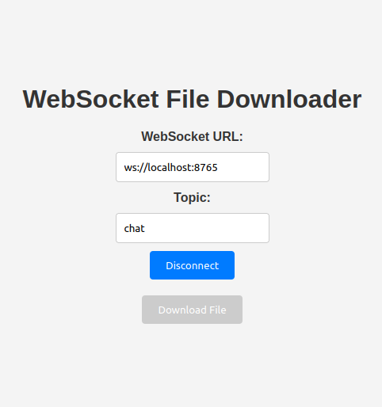
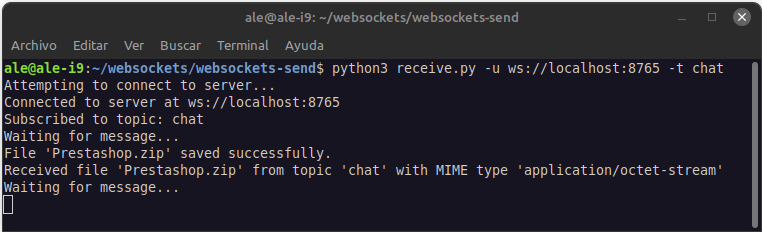
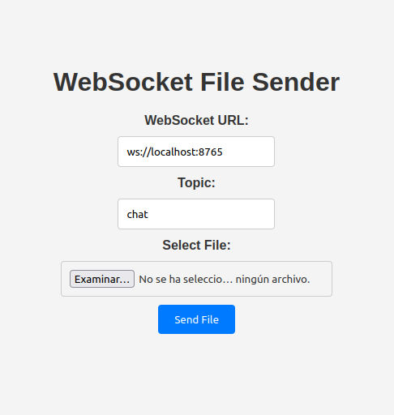
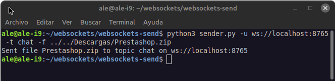

# Simple WebSocket File Distribution Server and Clients.

[Versión en español](README-spanish.md)

This project provides a WebSocket server for distributing files among clients. It allows clients to connect, subscribe to specific topics, and receive files sent by other clients.
It encodes the file data to base64 before sending it.

## Installation

First, clone the repository:

```sh
git clone https://github.com/soyunomas/websockets-send.git
```

Navigate into the project directory:

```sh
cd websockets-send
```

Install dependencies: 

```sh
pip install websockets
```

## Usage

### Start server

To start the WebSocket server, run the following command:

```sh
python3 server.py -p 8765 -i 0.0.0.0
```

Replace `8765` with the desired port number and `0.0.0.0` with the desired IP address.


### Open index.html or receive.py

Now open the `index.html` file in your web browser to connect to the WebSocket server. 



Alternatively, you can use `receive.py` to download files via the command line. The file will be saved in the directory from which you run `receive.py`.

For example:

`python receive.py -u ws://localhost:8765 -t chat`

This will connect to the WebSocket server at `ws://localhost:8765` and subscribe to the `chat` topic to receive files.



### Send file to de browser with sender.html

Open the `sender.html` file in your web browser to connect to the WebSocket server and send a file. 



### Alternative, send file to de browser with sender.py

Use the sender.py script to send files to the server. The command format is as follows:

```sh
python3 sender.py -u ws://localhost:8765 -t chat -f /path/to/file.txt
```

- `-u ws://localhost:8765`: This specifies the WebSocket server URL. Replace ws://localhost:8765 with the appropriate URL of your WebSocket server if it's different.
- `-t chat`: This specifies the topic to which the file will be sent. Replace chat with the desired topic.
- `-f /path/to/file.txt`: This specifies the path to the file you want to send. Replace /path/to/file.txt with the actual path to the file you want to distribute.



## File descriptions

### server.py

- **Description:** This file implements a WebSocket server for handling file distribution among clients. It listens for incoming WebSocket connections, manages subscriptions to topics, and forwards received files to subscribed clients.

- **Usage:** The server can be started using the provided command-line interface (CLI) options to specify the port and IP address to listen on.

- **Functionality:**
  Listens for WebSocket connections.
  Handles incoming messages from clients.
  Supports subscription to topics.
  Distributes files to clients subscribed to specific topics.

### sender.py

  **Description:** This file provides a command-line interface (CLI) for sending files to the WebSocket server. It connects to the server via WebSocket, reads files from the local file system, encodes them as base64, and sends them to the server with the specified topic.

- **Usage:** Users can specify the WebSocket URI, topic, and file path as command-line arguments to send files to the server.

- **Functionality:**
  Establishes a WebSocket connection to the server.
  Reads files from the local file system.
  Encodes files as base64.
  Sends files to the server with the specified topic.

### receive.py

- **Description:** This file provides a command-line interface (CLI) for receiving files from the WebSocket server. It connects to the server via WebSocket, listens for incoming messages, and saves received files to the local file system.

- **Usage:**
  Users can specify the WebSocket URI and topic as command-line arguments to receive files from the server.

- **Functionality:**
  Establishes a WebSocket connection to the server.
  Listens for incoming messages from the server.
  Saves received files to the local file system.

### index.html

- **Description:** This HTML file contains a simple web interface for interacting with the WebSocket server. It allows users to connect to the server, subscribe to topics, and download files received from the server.

- **Usage:** Users can open the HTML file in a web browser to access the web interface.

- **Functionality:**
  Connects to the WebSocket server using JavaScript.
  Allows users to subscribe to topics and download files received from the server.
  Provides a user-friendly interface for interacting with the server.

### sender.html

- **Description:** This HTML file provides a simple web interface for sending files to a WebSocket server. It allows users to connect to the server, specify the topic for the message, select a file from their local system, and send it to the server.

- **Usage:** Users can open the HTML file in a web browser and fill out the WebSocket URL, topic, and select a file to send. After connecting to the server, they can click the "Send File" button to upload the selected file to the server.

- **Functionality:** Connects to the WebSocket server using JavaScript. Allows users to specify the WebSocket URL and topic for the message. Provides a file input field for selecting files to send. Upon connecting to the server and selecting a file, users can send the file to the server by clicking the "Send File" button. Displays a confirmation message after the file is successfully sent.

## How It Works

- Clients can connect to the server using a WebSocket URI.
- Upon connection, clients can subscribe to specific topics to receive files related to those topics.
- When a client sends a file to a topic, the server distributes the file to all clients subscribed to that topic.
- File messages are formatted as follows: `{mime_type}:{file_name}:{file_data}`.

# Project File Size Limitation

In this project, the maximum file size for uploads and downloads is set to 500 MB. This limit is enforced in the following files: `server.py`, `sender.py`, and `receive.py`.

To change the maximum file size limit, you need to modify the relevant code sections in these files.

## Instructions to Change Maximum File Size

1. **Open `server.py`, `sender.py`, and `receive.py`.`**:
   
   - Locate the section of the code that sets the maximum file size.
   
   - You will find the following lines:
     
     ```python
     # Set the maximum size to 500 MB
     max_size = 500 * 1024 * 1024  # 500 MB
     ```
   
   - Modify the `max_size` value as needed.

## ## Dependencies

- Python 3.x
- websockets

### 
